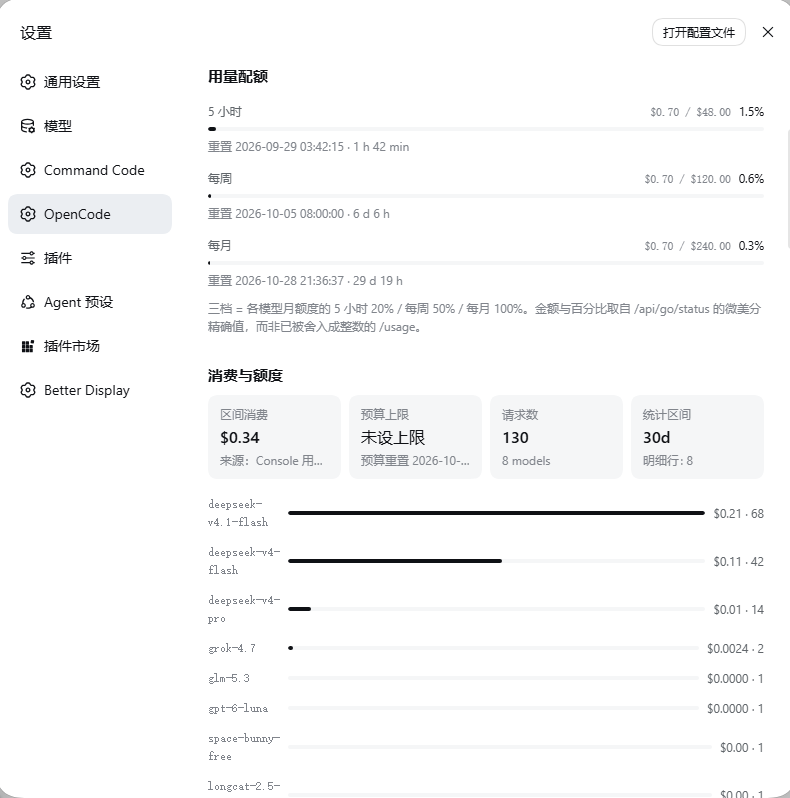

# OpenCode 账户页（dsh-opencode-account）

非官方 DeepSeek Harness 插件：把 **DeepSeek Harness** 接到 **OpenCode Go / Go Plus**（[opencode.ai](https://opencode.ai)），
并在 **设置 → OpenCode** 里显示账户页——配额窗口、Console 消费报表、各模型的真实消费与额度、实时模型目录。
页面形态参考 `@mars-sea/dsh-commandcode-provider` 的设置页（行式布局 + 同款配额条），但**只做展示，不带设置表单**。

## 界面预览



## 仓库结构

```
<插件目录>\
├─ package.json           插件清单（dsh.bundle + dsh.client）
├─ cordis.patch.yml       插件包层：注册 3 条 provider 路由 + 账户页
├─ model-metadata.json    models.dev 快照；host 运行时读它展示完整能力
├─ lib/
│  ├─ index.js            host 半：注册 GET /opencode/account（零第三方依赖）
│  ├─ opencode.js         host 半：opencode.ai HTTP 客户端（两张命名空间）
│  ├─ catalog.js          静态额度表、价目表与路由归属
│  └─ client.js           浏览器半：账户页（window.__ModuleLoader__ 格式，无构建步骤）
├─ scripts/
│  ├─ fetch-model-metadata.mjs   拉 models.dev → model-metadata.json
│  ├─ build-provider-models.mjs  生成两份配置，--check 校验是否与套餐一致
│  └─ probe-protocol.mjs         协议实测（唯一没有元数据来源的项）
├─ src/yulantu.png        界面预览
├─ test-client.mjs        浏览器半：假 __ModuleLoader__ + stub react 渲染全分支
├─ test-config.mjs        让 dsh 自己的适配器加载生成的配置
├─ test-reasoning.mjs     推理等级契约（default ≡ Off 等）
├─ test-host.mjs          host 半：真调 /opencode/account
└─ LICENSE                MIT
```

## 一、它接入了什么

| 面 | 做法 |
|---|---|
| **模型 provider** | 以 pi-ai 内置 `opencode-go` 目录为元数据来源，按你的套餐补全成 **30 个模型**；因协议不同拆成 **3 条路由**（见下） |
| **账户页** | 插件在 host 注册 `GET /opencode/account`，浏览器页只读这个接口；**API key 永不进浏览器**（只回掩码） |

### 为什么是 3 条路由

两个约束是从 dsh-llm-pi-ai 的解析器里读出来的，不是推测：

1. **`models` 条目没有 `api` 字段**（schema 的 `modelFields` 里没有它），而
   `resolveRouteModels` 取的是 `api = request.api ?? base.api ?? routeApi` ——
   **条目自己写的 `api` 完全不参与**。所以一个 pi-ai 目录里没有描述的模型，
   只能靠**路由级**的 `api` 拿到协议。
2. **一条路由只能有一个 `api`**。

你的 Go 套餐 30 个模型跨三种协议，于是拆成三条（同一个 key、同一组 headers）：

| 路由 | 协议 | 模型数 | 网关端点 |
|---|---|---|---|
| `opencode-go` | `openai-completions` | 21 | `/chat/completions` |
| `opencode-go-responses` | `openai-responses` | 6 | `/responses` |
| `opencode-go-messages` | `anthropic-messages` | 3 | `/messages` |

（`opencode-go-messages` 之所以有 3 个而不是 2 个，是因为 `minimax-m2.7` 的协议被实测纠正过来了 —— 见下文。）

> **选择器里会出现三个 OpenCode Go 条目**（`OpenCode Go` / `OpenCode Go (Responses)` /
> `OpenCode Go (Messages)`）。这是当前 DSH 配置形状的硬约束，不是设计偏好：
> 一个模型属于哪条路由，由网关给它分配的端点决定。

### 为什么模型清单要自己维护

pi-ai 内置目录与线上套餐会漂移。2026-09-28 实测：

- 内置目录只有 **27** 个，比网关**少 8 个**：`gpt-6-luna`、`grok-4.7`、`deepseek-v4.1-flash`、
  `deepseek-flash`、`mimo-v2.6-flash`、`mimo-v2.6-pro`、`space-bunny-free`、
  `longcat-2.5-preview-free` —— 这些在 Models 页面里**根本选不到**；
- 还多带 **5 个已下线**的 id：`glm-5.1`、`kimi-k2.6`、`omen-alpha`、`qwen3.6-plus`、`qwen3.7-max`。

清单由脚本对齐（可随时重跑）：

```sh
node scripts/build-provider-models.mjs           # 拉网关清单，重写两个配置文件
node scripts/build-provider-models.mjs --check   # 校验是否已对齐（不一致则退出码 1）
node scripts/build-provider-models.mjs --offline # 无网络时沿用已提交清单
```

结果写进 `cordis.patch.yml`（插件包层）**和** `$DSH_HOME/settings.yaml`（用户层，即 Models
页面会改写的那个文档）——两处都要写，否则在 GUI 里点一次保存就会把清单丢掉。

### 能力：读权威目录，不靠猜也不靠试

模型能力来自 **[models.dev](https://models.dev) 的 `api.json`** —— OpenCode 生态发布的模型目录，
控制台里那份 features 列表就出自它。一次请求给全部：

| 字段 | 内容 |
|---|---|
| `modalities.input` | `text` / `image` / `audio` / `video` / `pdf` |
| `reasoning_options` | 推理档位（如 `low` / `high` / `max`） |
| `limit` | `context` / `output` |
| `cost` | 输入 / 输出 / 缓存读价 |
| `attachment`、`tool_call`、`structured_output`、`temperature`、`knowledge` | 其余能力 |

```sh
node scripts/fetch-model-metadata.mjs      # 拉 models.dev → model-metadata.json
node scripts/build-provider-models.mjs     # 据此生成两份配置
```

#### 但 dsh 只能声明 `text` 和 `image`

```ts
export interface ModelModalityMap { text: 'text'; image: 'image'; }
```

`models.dev` 里**有 18 个模型带 `audio` / `video` / `pdf`，这些写不进路由配置**（schema 只认
那两个值）。它们仍然**显示在账户页**（`额外输入: video · pdf`），只是不能据此启用附件。

#### 协议没有元数据来源，只能实测

`models.dev` 在 provider 级只给一个 `npm` / `api` 对（`@ai-sdk/openai-compatible`），
**区分不了这个订阅跨的三种端点**，模型级更没有协议字段。而协议由**路由**决定，
配错等于模型直接不可用 —— 所以这一项必须问网关。它抓到 1 个：

```
minimax-m2.7   配置 openai-completions → 网关 400 ModelProtocolUnsupported
               实际只在 anthropic-messages 上可用   → 已迁到 messages 路由
```

pi-ai 的目录说它是 `openai-completions`，所以这不是笔误，是**元数据本身过时**。
（附带确认：`minimax-m3` 两个协议都能用，`minimax-m2.7` 只认 `messages`。）

**修正记录在代码里，不是生成物**：`scripts/build-provider-models.mjs` 的 `PROTOCOL_FIXES`
常量保存例外，`probe-protocol.mjs` 只负责**发现**新的例外并打印可直接粘贴的条目：

```sh
node scripts/probe-protocol.mjs    # 逐个验证；有分歧时打印要加进 PROTOCOL_FIXES 的行
```

这样做的原因：探测的完整输出是"24 行与声明一致 + 1 行修正"，只有修正值得留 ——
那是一个常量，不是一个需要入库的产物。

> **附带发现**：在你当前工作区，`gpt-6-luna` / `gpt-5.6-luna` 报
> `403 unsupported_country_region_territory`，`grok-4.6` / `grok-4.7` 报
> `Endpoint is unavailable`，`muse-spark-1.2/1.3` 需要先在控制台允许 paid endpoints。
> 这是 provider 侧的可用性（多半与工作区隐私区域设置有关），**不是配置问题**，
> 但意味着这几个模型现在选它们会失败。

#### 已删除：图像探测

早期版本用"发一张纯红图、问模型什么颜色"逐个探测图像能力，这个方法有硬伤，已连同
其脚本与结果文件一起删除：

- 只问得了 image，**永远发现不了** audio / video / pdf；
- 30 个模型 = 30 次真实请求，每轮都消耗额度；
- 单次答案就有噪声 —— 它把 `longcat-2.5-preview-free` 判成"不支持"，
  而目录说它有 image。

目录未收录的 `deepseek-flash` 现在由 `EXTRA_MODELS` 直接声明，不再需要探测。

#### 哪些文件需要入库

| 文件 | 入库 | 原因 |
|---|---|---|
| `cordis.patch.yml` | ✅ | DSH 启动时读的配置本体 |
| `model-metadata.json` | ✅ | **host 运行时依赖**：账户页的"额外输入"读它。不入库则克隆后跑起来能力栏是空的（`fetch-model-metadata.mjs` 可刷新） |
| `protocol-capability.json` | ❌ 已删 | 信息量只有 1 条修正，已变成代码里的 `PROTOCOL_FIXES` 常量 |
| `vision-capability.json` | ❌ 已删 | 方法被 models.dev 取代 |

### 路由级 `baseURL`（漏了会直接报错）

每条路由都必须写 `baseURL`，而且**拼法由该路由的 `api` 决定**——这不是风格问题，
`resolveRouteModels` 对"目录未描述的模型"会强制要求它，拼错则路径翻倍：

| 协议 | 正确的 `baseURL` | SDK 追加 | 最终端点 |
|---|---|---|---|
| `openai-completions` | `…/zen/go/v1` | `/chat/completions` | `/zen/go/v1/chat/completions` |
| `openai-responses` | `…/zen/go/v1` | `/responses` | `/zen/go/v1/responses` |
| `anthropic-messages` | `…/zen/go`（**不要 `/v1`**） | `/v1/messages` | `/zen/go/v1/messages` |

漏写时的症状是 Models 页每张卡都报
`model "…" needs a baseURL; the installed catalog does not describe this route`。

### 推理等级（`reasoningEfforts`）

选不了推理等级是同一处 config 的疏漏，而且成因更绕——两个"没有值"的含义正好相反：

| 写法 | pi-ai 的意思 | dsh 的意思 |
|---|---|---|
| `level: null`（空值键） | **不支持**该等级（`getSupportedThinkingLevels` 把它过滤掉） | **支持**，但发送时不带该参数 |
| 键缺失 | 整个 map 缺失 → **全部等级可用** | — |

所以 dsh 只允许 `off` 留空，其余等级留空会直接报
`reasoningEfforts.minimal needs the wire value dispatch should send`。

pi-ai 还有个陷阱：`getSupportedThinkingLevels` 对 `reasoning` 未置位的模型只回 `['off']`，
而**目录里没有描述的模型（也就是新补的那 8 个）正是这种情况** —— 于是它们的推理等级
选择器整个不出现。所以生成器现在给全部 30 个模型显式写出 `reasoningEfforts`：

```yaml
        - id: gpt-6-luna
          name: GPT 6 Luna
          contextWindow: 1050000
          maxTokens: 128000
          input: ['text', 'image']
          reasoningEfforts:      # off 可以留空，其余必须带 wire 值
            off:
            minimal: minimal
            low: low
            medium: medium
            high: high
            max: max
```

规则：**`null` 的等级直接不写**（表示不支持），`off` 始终补上，其余等级带 wire 值。
生成器写文件前会断言"每个模型至少有一个 `off` 以外的等级"——这个回归在 diff 里几乎
看不出来，却会让所有模型的推理控制一起消失。

### 选择器里的 `default` 到底是什么档位

**它不代表任何档位，而且和 `Off` 逐字节等价 —— 两者都请求「关闭思考」。**

那个 `default` 选项是 dsh 的 `effort.providerDefault`（提供方默认），只在**路由没有配置
`reasoning` 默认档位**时出现；它的值就是 `undefined`。链路如下（用 pi-ai 自己的 API 层
捕获实际请求体得到）：

| 界面选项 | dsh 传给 pi-ai | pi-ai 实际发出的 body |
|---|---|---|
| `default` | 省略 `reasoning` | `thinking:{"type":"disabled"}`，无 `reasoning_effort` |
| `Off` | `reasoning:"off"` → **也省略** | `thinking:{"type":"disabled"}`，无 `reasoning_effort` |
| `Low` | `reasoning:"low"` | `thinking:{"type":"enabled"}` + `reasoning_effort:"low"` |
| `High` | `reasoning:"high"` | `thinking:{"type":"enabled"}` + `reasoning_effort:"high"` |
| `Max` | `reasoning:"max"` | `thinking:{"type":"enabled"}` + `reasoning_effort:"max"` |

两处代码决定了这张表：

- dsh 的 `profileOptions()`：`const enabledReasoning = reasoning === "off" ? undefined : reasoning`
  —— `off` 被归一成"不传"，于是与 `default` 合流；
- pi-ai 的 `thinkingFormat: "deepseek"` 分支：没有 `reasoningEffort` 时，只要
  `thinkingLevelMap.off !== null` 就**主动发** `thinking:{"type":"disabled"}`。

**但上游并不执行这个 `disabled`**：同一提示词各跑 3 次，`reasoning_content` 长度分别是
不传 152/157/156、`disabled` 242/157/228、`enabled+high` 108/164/166 —— 三者**都在思考**，
长度波动也不体现档位差异。

所以 `default` / `Off` 的**实际效果是"网关自己决定"**，具体强度从 API 观测不到。
需要注意的隐患：上游**一旦开始执行** `thinking:disabled`，选 `default` 或 `Off` 的会话会
**突然失去思考能力**。

### 已经把它默认成 `High`（消除那个坑）

三条路由现在都带一个路由级默认：

```yaml
      opencode-go:
        reasoning: high        # ← 用户没选档位时用它，而不是"提供方默认"
```

效果：dsh 会为每个**支持该档位**的模型发布 `defaultEffort`，选择器里那个
"提供方默认"条目随之消失，默认直接落在 `High`（仍然是可改的，`Off`/`Low`/`Max` 照常可选）。

选 `high` 而不是别的，是因为它的**支持面最广**：

| 档位 | `opencode-go` (22) | responses (6) | messages (2) |
|---|---|---|---|
| `low` | 18 | 6 | 2 |
| `medium` | **11** | 6 | 2 |
| **`high`** | **20** | **6** | **2** |
| `max` | 19 | 3 | 2 |

**28/30 个模型因此拿到默认档位**；只有 `kimi-k3`（只支持 `off`/`max`）与 `qwen3.8-max`
（不支持 `high`）保留"提供方默认"条目。

> 不支持的模型**不会报错**：dsh 的 `describableReasoningLevel` 对取不到的档位返回"无默认"
> 而不是抛异常（抛错只发生在请求路径上用户显式选了不支持的档位时）。生成器会在写入前
> 断言"每条路由至少有一个模型支持该默认值"，并打印哪些模型被跳过。

代价要清楚：**默认从此是 `High`**，比"网关默认"更费 thinking token。想改就改生成器里的
`DEFAULT_REASONING` 再重跑，或直接在 `settings.yaml` 里改 `reasoning:`。

### 会话头

`x-opencode-session` 是**必需**的：缺了直接 `400 MissingSessionID`，而 pi-ai 与 dsh
都不会生成这个名字的头（pi-ai 只对目录里显式开启 session affinity 的厂商发
`x-session-affinity` / `x-client-request-id`，`opencode-go` 不在其中）。所以它静态写在
每条路由的 `headers` 里：

```yaml
- id: llm-pi-ai
  name: '@deepseek-ai/dsh-llm-pi-ai'
  config:
    providers:
      opencode-go:
        displayName: OpenCode Go
        api: openai-completions
        baseURL: https://opencode.ai/zen/go/v1
        apiKeyEnv: OPENCODE_API_KEY
        headers:
          x-opencode-session: 7f3c1a92-5d84-4e6b-9c07-2ab5e13f8d40
        models:
        - id: deepseek-v4-flash
          name: DeepSeek V4 Flash
          contextWindow: 1000000
          maxTokens: 384000
          input: ['text']
        # … 另外 29 个（清单由脚本生成）
```

> 网关要的是**稳定**的会话 id，不是唯一的。dsh 的 `headers` 是纯字符串字典，没有
> `${ENV}` 插值，所以这里就是一个固定 UUID。
> dsh 的 harness 归属头只有 `user-agent`，与 `x-opencode-session` 不冲突，会被原样发出。

## 二、数据从哪来（以及为什么没有"余额"）

插件只调用 opencode.ai 自己的接口，分两个命名空间：

| 接口 | 内容 | 实测 |
|---|---|---|
| `GET {consoleURL}/api/go/status` | **配额与订阅的唯一权威**：`product`、`renewalProduct`、`useBalance`、`cancelAtPeriodEnd`、计费周期，以及 `fiveHour`/`week`/`month` 三个窗口的 `usedMicroCents`、`limitMicroCents`、`resetsAt` | 200 |
| `GET {baseURL}/usage` | 同样三个窗口，但只有 `percent`（**整数**）与 `resetsAt` | 200，仅作 `go/status` 失败时的兜底 |
| `GET {baseURL}/models` | 该密钥可调用的模型目录 | 200，本次 30 个 |
| `GET {consoleURL}/api/v2/usage/export?range=30d` | 逐日消费 CSV（`cost_micro_cents`、token 列） | 200 |
| `GET {consoleURL}/api/v1/usage/export?scope=member&range=30d` | 同上，旧命名空间 | **403**（该密钥读不到 v1；v2 才可用） |
| `GET {consoleURL}/api/v1/budgets/members` | 成员预算报表：`limit_micro_cents`、`spent_micro_cents`、`resets_at`，以及账号 email/user_id | 200 |

### 为什么不用网关的 `/usage` 做配额

因为它把百分比**舍入成整数**，而控制台用的是 `go/status` 的精确微美分：

| 窗口 | `/usage` | `go/status` |
|---|---|---|
| 5 小时 | `percent: 0` | `$0.338495 / $48` = **0.705%** |
| 每周 | `percent: 0` | `$0.338495 / $120` = 0.282% |
| 每月 | `percent: 0` | `$0.338495 / $240` = 0.141% |

**这就是"页面与控制台不一致"的根因** —— 轻度使用时 `/usage` 永远是 0，而控制台显示 0.7%。
现在页面直接用 `go/status` 的金额与百分比，`/usage` 只在读不到 `go/status` 时兜底。

**档位也不需要你手填**：`go/status` 返回 `product`（`"go"` 或 `"go-plus"`），页面自动标注并写明来源。
插件的默认配置**刻意不写 `plan`** —— 写了就等于把某一档当成所有人的档位；读不到该接口时页面显示
"档位未标注"，而不是猜一个。

**没有余额端点，这不是本插件的取舍**：

- `GET /zen/v1/balance`、`GET /zen/v1/credits`、`GET /console/api/v1/balance` 实测全部 **404**；
- Zen 命名空间下**没有** balance/credits 路由（源码目录里只有 chat/messages/models/responses）；
- Console 的余额字段只经浏览器 OAuth 会话的 `billing.get` 暴露，`/console/api/billing/status` 对 API key 回 **403**；
- 官方 feature request [anomalyco/opencode#10448](https://github.com/anomalyco/opencode/issues/10448) 仍然 **open**，无官方回复。

### 每模型金额：真实消费，不是推算

额度表（`lib/catalog.js`）给出每个模型的**月度上限**；**已用金额**取自 Console 用量导出的
真实 `cost_micro_cents`，并**按当前计费周期过滤**（额度随订阅月重置，导出却是按天区间，
不过滤就会把上个月的用量算进本月）。

> 早期版本用"月度窗口百分比 × 月额度"去估算每个模型的已用金额，**那是错的**：
> Go 的额度是**按模型独立**的，而窗口百分比是某一个模型自己额度的占比 ——
> 一个模型花了 $0.34 会显示成"每个模型都用了 0.14%"。现在用真实消费，没有这种歧义。

导出不可读时，模型卡片只显示月额度、不显示已用/剩余，而不是编一个数。

## 三、页面结构（自上而下）

1. **页头**：标题、说明、刷新按钮、更新时间、每 5 分钟自动刷新提示。
2. **账户**：账号（email/user_id）、密钥掩码、密钥来源、provider 路由、API 根、会话 ID、更新时间；下面一行是**订阅档位**徽章，配置里的那一档标 `← 当前档位`。
3. **用量配额**：三行，每行是 `label + 百分比 + 4px 填充条 + 重置时间 · 倒计时`；触限（`status: rate-limited` 或 100%）时百分比行加红字、条变红。
4. **消费与额度**：区间消费、预算上限（未设上限就写"未设上限"，绝不写成 0）、请求数、统计区间；有 Top 模型条形时按消费排序展示；下面附「为什么没有"余额"数字」的说明与 Console 链接。
5. **模型目录**：每个模型一张小卡——id、名称、月额度徽章（`不限量` / `未收录额度`）、已用/剩余进度条、官方价格（入/出/缓存读/缓存写，DeepSeek 系列另标峰时价），以及 `额外输入` 里 dsh 声明不了的模态。
6. **版本页脚**。

> 这里**没有设置表单**。早期版本在底部放了一个（档位下拉 + 高级设置 + 浮动保存条），
> 但它是个**假保存**：`save()` 只设了个本地标志，不写回任何配置，刷新即丢，却显示"已保存"。
> 与其实现一套真正的配置写回（要接 dsh 的 settings remote 并改写你的 `settings.yaml`），
> 不如去掉它 —— 这些值本来就很少改，改的话直接编辑
> `cordis.patch.yml` 或 `$DSH_HOME/settings.yaml`（见「安装」一节）。

## 四、安装

### 1. 凭据

API key 存进 harness 凭据（`$DSH_HOME/.credentials.yaml` 的 `refs`，或在 **设置 → Models** 里保存）：

```yaml
refs:
  OPENCODE_API_KEY: oc_sk_…
```

解析顺序（先命中者胜）：harness 凭据服务的 `apiKeyEnv` 引用 → 同名环境变量 → `OPENCODE_GO_API_KEY` / `OPENCODE_ZEN_API_KEY`。
都没有时页面显示"未找到 API 密钥"并给出该存到哪里，而不是静默空白。

### 2. 装进 profile

把 `<插件目录>` 换成你放这份代码的位置（路径含空格要加引号）：

```sh
dsh plugin --profile web add "<插件目录>"
```

或手工两步 —— 在 `$DSH_HOME/profiles/web/package.json` 里写依赖，并把包名加进 `dsh.profile.bundles`：

```json
{
  "dependencies": { "dsh-opencode-account": "file:<插件目录>" },
  "dsh": { "profile": { "bundles": ["…", "dsh-opencode-account"] } }
}
```

然后 `cd "$DSH_HOME/profiles/web" && pnpm install`，**重启 dsh**。

装完在 **设置 → OpenCode** 就能看到页面；**设置 → Models** 里会出现三条 OpenCode Go 路由。

### 3. 在别的设备 / 给别人用

这个插件不绑定某台机器或某个账号，**装好 + 配好 `OPENCODE_API_KEY` 即可**：

| 需要改的 | 说明 |
|---|---|
| `OPENCODE_API_KEY` | **唯一必需项**。每台设备填自己的 key（可以是同一个 key，也可以是不同账号的） |
| 模型提供方 | **不用配**。三条 OpenCode Go 路由随插件的 bundle 层提供，装完即出现在 **设置 → Models**（`test-config.mjs` 断言了这三个条目及其显示名） |
| 档位 | **不用配**。页面从 `/api/go/status` 读 `product`，Go 与 Go Plus 都会自动认对 |
| `session` | 默认值可直接用。同一把 key 跑在多台机器上时，建议各给一个 UUID v4，让 prompt 缓存互不干扰 |
| 模型清单 | 已随包提供（`cordis.patch.yml` + `model-metadata.json`）。想按当时的网关重新对齐就 `node scripts/build-provider-models.mjs` |

两条已实测的保证：

- **新机器**（`settings.yaml` 里完全没有 `llm-pi-ai` 段）→ 仅靠插件的 bundle 层就能对话，实测返回 `NEWUSER-OK`；
- **已有别的 pi-ai provider 的机器** → 层叠是**逐键合并**而非整段替换：你的 `acme-gateway` 与三条 OpenCode Go 路由共存，实测返回 `LAYER-OK`。

> **你已有的 `llm-pi-ai` 配置不会被覆盖**。`settings.yaml` 的优先级高于插件的 bundle 层，
> 所以脚本会把三条 OpenCode Go 路由**合并**进你的 `providers`，其余 provider 与文件其他部分
> 原样保留（跑的时候会打印 `keeping N unrelated provider(s)`）。
> 这一点是刻意修的：早期版本会从 `llm-pi-ai:` 一直删到下一个顶层键，等于抹掉别人的配置。

## 五、验证

```sh
npm test                     # 全部离线检查（不含需要凭据的 live 调用）
```

逐项：

```sh
node test-client.mjs         # 渲染 loading/就绪/触限/缺密钥/上游失败/权限不足/中英文，并断言设置表单不再出现
node test-config.mjs         # 让 dsh 自己的适配器加载生成的配置：30/30 可解析、协议修正生效
node test-reasoning.mjs      # 推理等级契约：default ≡ Off，命名档位带 reasoning_effort
node test-host.mjs           # 真调 opencode.ai：配额/目录/预算/能力，并断言响应体不含完整 key
node test-host.mjs --offline # 无网络：断言缺凭据时的提示路径
node scripts/build-provider-models.mjs --check   # 模型清单/能力/协议是否仍与套餐一致
```

> `test-config.mjs` 是其中最要紧的一个：它驱动 `dsh-llm-pi-ai` 本体去解析
> `cordis.patch.yml`，所以断言的是"**dsh 接受这份配置**"，而不是"这份 YAML 能解析"。
> 开发期间两个真缺陷（缺 `baseURL`、`minimax-m2.7` 协议错）都只会在 dsh 启动时暴露，
> 而手工验证不算回归测试。

端到端验证用**隔离实例**，不碰正在用的那个：

```sh
$env:DSH_HOME="F:\Code\Ai\Opencode Provider\.dsh-test"
# 起界面（3099）
dsh --profile octest --patch "./.dsh-test/port-overlay.yml"
# 或一次性跑通一条真实请求（把默认 agent 指向补齐的新模型）
dsh --profile octest --patch "./.dsh-test/model-overlay.yml" "reply with exactly: OK"
```

已验证的事实（本机实测）：

- `GET http://127.0.0.1:3099/opencode/account` → 200，返回真实账号（形如 `user@example.com`）、30 个模型、30/30 命中额度表、预算报表 1 行；
- `--dump-config` 显示插件层 patch 了 `@deepseek-ai/dsh-base` 的 `llm-pi-ai` 行，`providers.opencode-go` 带着 `x-opencode-session`；
- 客户端 bundle 已随启动 payload 下发（含 `id: 'dsh-opencode-account'`）。

## 六、已知限制

- `/usage`、`/console/api/...`、`models.dev` 都属非公开契约；上游改动时页面显示错误而不是崩溃。
- **用量导出优先走 v2**：`/console/api/v2/usage/export` 对这把 key 返回 200，而 **v1 返回 403**。
  两者都失败时消费卡退回预算报表口径，并明说权限不足。
- **每模型的"已用"是真实消费，月额度则来自文档**：官方只按窗口给百分比，所以月额度取自
  [Go 文档](https://opencode.ai/docs/go/) 的静态表；文档未收录的模型标 `未收录额度`。
- **模型可用性受 provider 侧限制**：实测 `gpt-6-luna` / `gpt-5.6-luna` 报
  `403 unsupported_country_region_territory`（多半与工作区隐私区域有关，需在 [控制台](https://opencode.ai/auth)
  设为 Global），`grok-4.6` / `grok-4.7` 报 `Endpoint is unavailable`，`muse-spark-*` 需先允许 paid endpoints。
- **pi-ai 目录的价格有 3 处过时**（`deepseek-v4-flash`、`deepseek-v4-flash-vision-exp`、`glm-5.3-flash`）：
  本插件的价目表与 models.dev 一致，但 DSH 的成本显示走 pi-ai 的目录，而路由配置没有 `cost` 字段可覆盖。
- **档位与每模型消费都依赖 Console 接口**：读不到 `/api/go/status` 时档位显示"未标注"、
  配额退回 `/usage` 的整数百分比；读不到用量导出时模型卡不显示已用/剩余（而不是编一个数）。
- 页面只展示，不提供充值或切换订阅入口。

## License

MIT。`@mars-sea/dsh-commandcode-provider` 仅作为页面形态的参考（同为 MIT），本插件未复制其代码。
